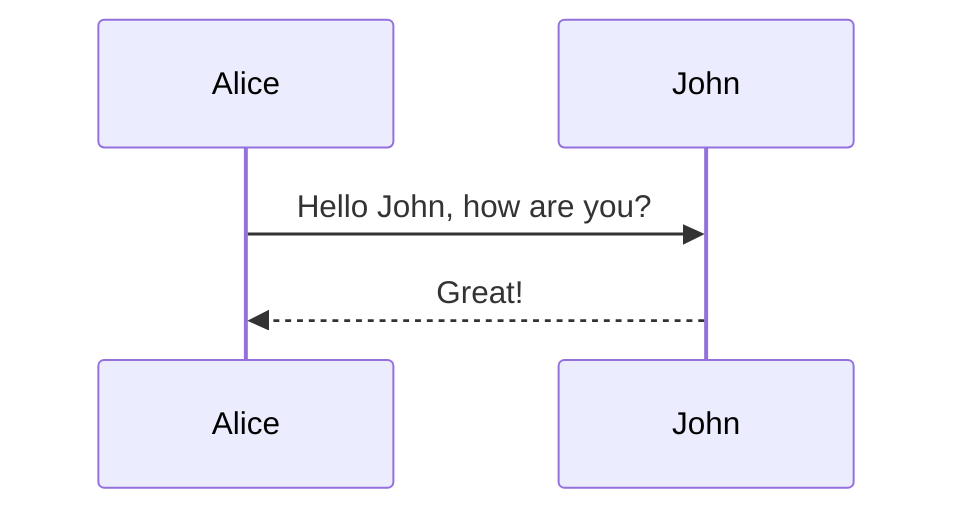
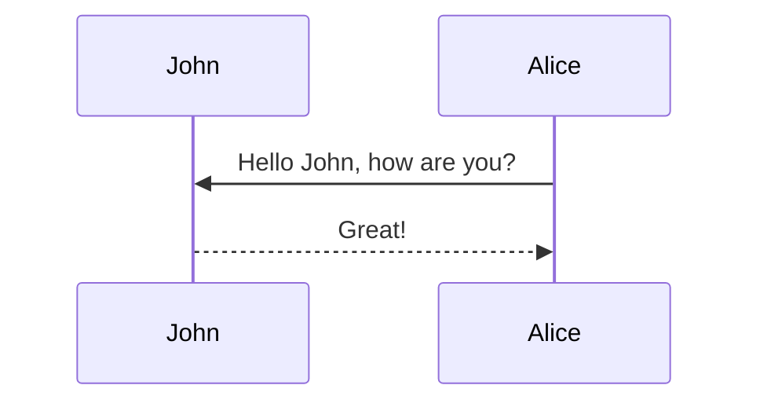
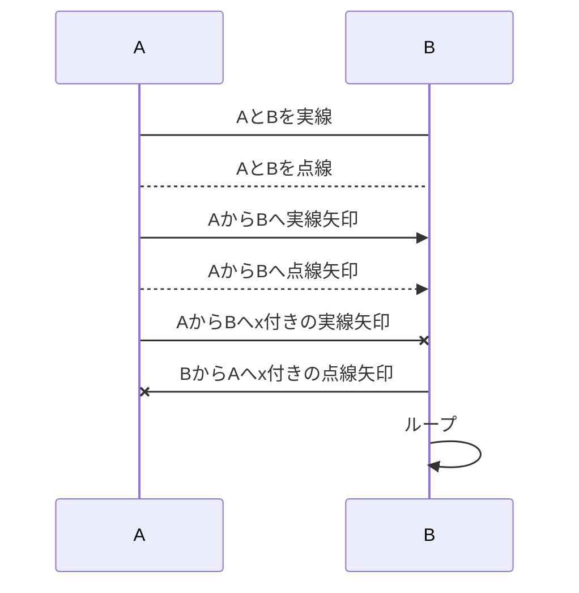
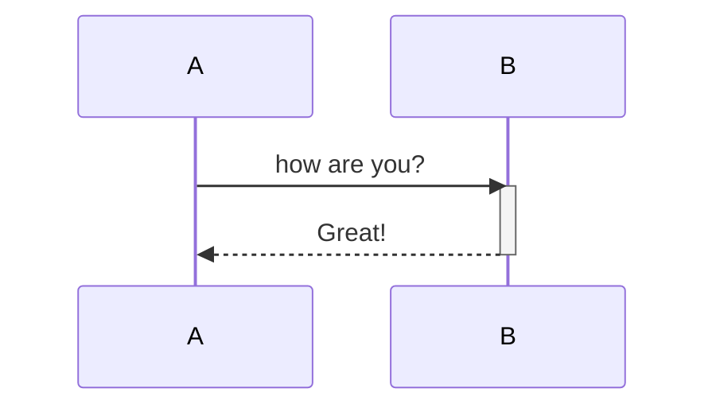
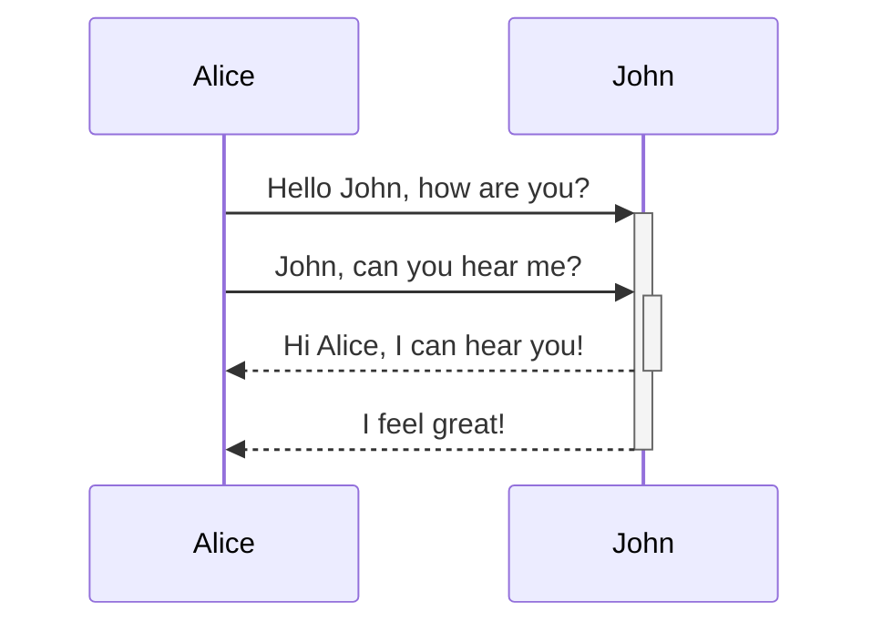
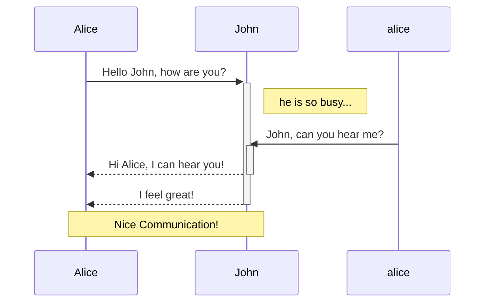

# Mermaidとは

+ シーケンス図とかが手軽にさくっと描ける
+ 複雑な構図とかは苦手

# Mermaid記法

**NOTE: GitHub上でシーケンス図を表示するためには下記のようなChrome拡張機能が必要です**

**NOTE: To view a sequence diagram on GitHub, you need the following chrome extension;**

[mermaid-diagrams](https://chrome.google.com/webstore/detail/mermaid-diagrams/phfcghedmopjadpojhmmaffjmfiakfil)

## Sequence diagrams



## Lifeline

+ 使用した言葉がそのまま反映される
+ ライフラインの消滅を書き示す方法はない
+ ライフラインは登場した順に左から増えていく



### participant A as [name]

その後の記述では省略して```A```と書くことができる

## Message

mermaid記法の基本は**左から右**へ書いていくこと！
方向を右から左にする場合は、矢印の向きではなく、AとBを入れ替える

| 記号     | 意味                              |
| -------- | --------------------------------- |
| A -> B   | AとBを実線で繋ぐ                  |
| A --> B  | AとBを点線で繋ぐ                  |
| A ->> B  | AとBを方向つきの実線で繋ぐ        |
| A -->> B | AとBを方向つきの点線で繋ぐ        |
| A -x B   | AとBをxつきの実線で繋ぐ（非同期） |
| A --x B  | AとBをxつきの点線で繋ぐ（非同期） |

```md
sequenceDiagram
  A->B:AとBを実線
  A-->B:AとBを点線
  A->>B:AからBへ実線矢印
  A-->>B:AからBへ点線矢印
  A -x B:AからBへx付きの実線矢印
  B -x A:BからAへx付きの点線矢印
  B->>B:ループ
```



## ExecutionSpecification

+ ライフラインが実行状態 (ExecutionSpecification) かどうかを```activate```と```deactivate```で示す
+ または```+```と```-```を矢印の後ろにつける
+ ```activate```か```+```をつけると実行仕様の最初、```deactivate```か```-```をつけると実行仕様の終わりを表す

### ```activate```と```deactivate```の場合

```md
sequenceDiagram
  A->>B:how are you?
  activate B
  B-->>A: Great!
  deactivate B
```



### ```+```と```-```の場合

```md
sequenceDiagram
  Alice->>+John: Hello John, how are you?
  Alice->>+John: John, can you hear me?
  John-->>-Alice: Hi Alice, I can hear you!
  John-->>-Alice: I feel great!
```



## Notes

```Note [Position] [Actor]```でシーケンスの途中にメモを残す

+ Positionは```right of```, ```left of```, ```over```で指定
+ Actorはどのライフラインにつけるか
+ Positionで```over```を使用する時は橋渡しのメモになり、Actorをカンマ区切りで複数選択する


