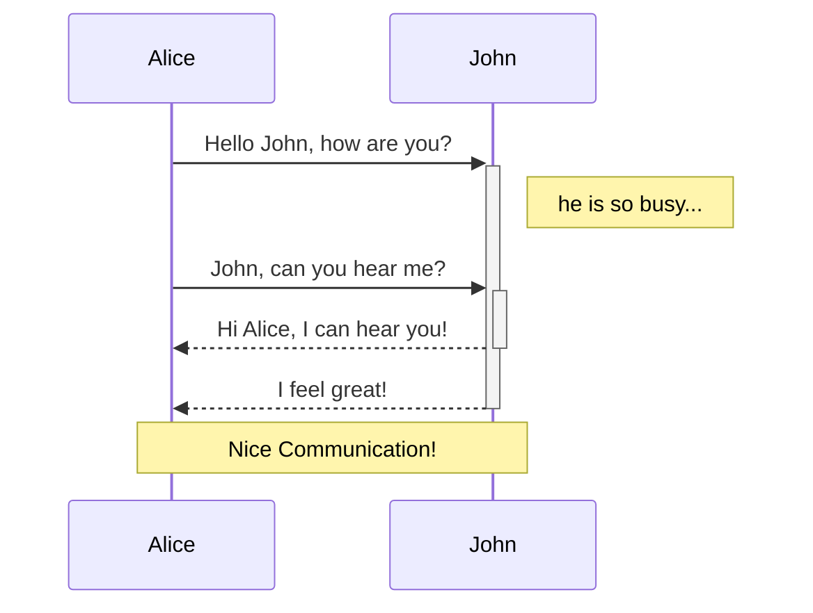
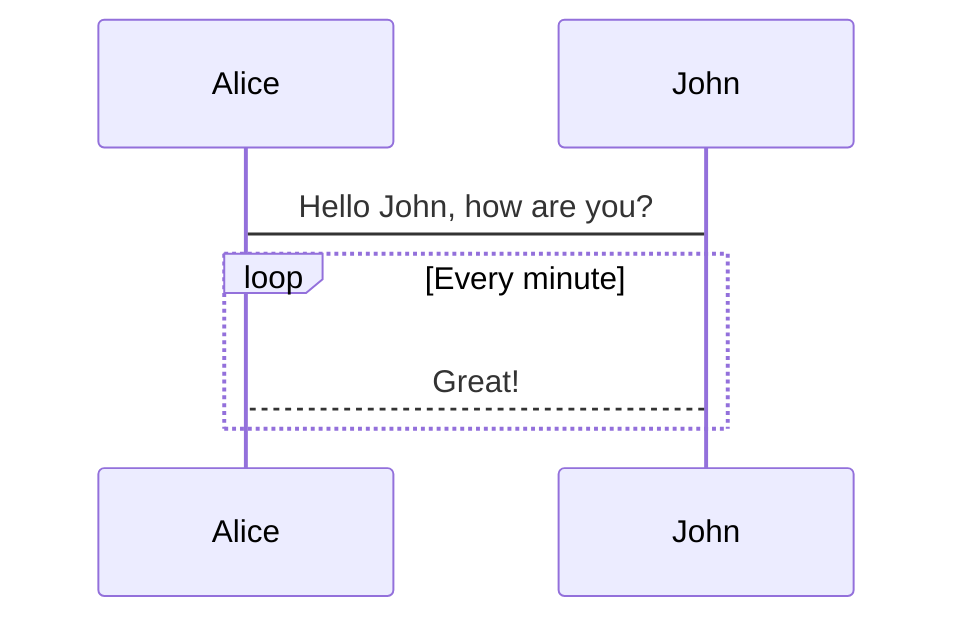
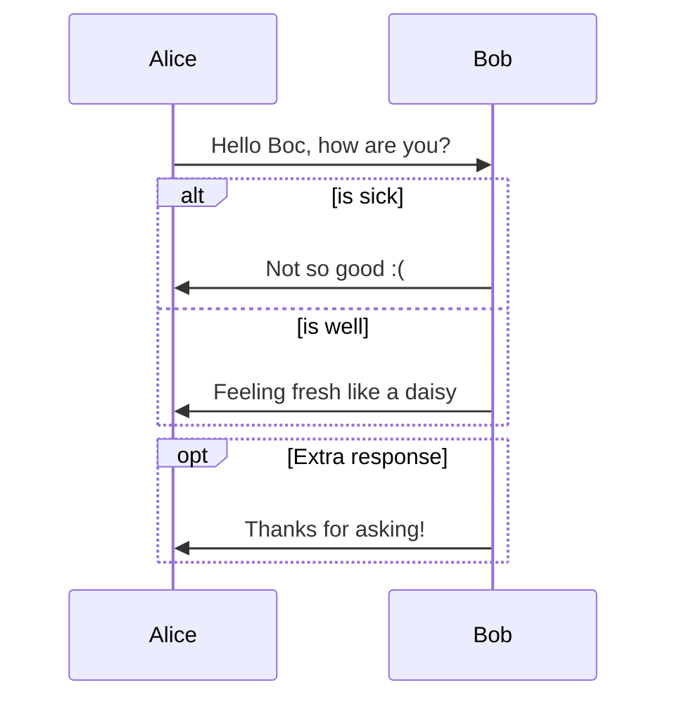

# Mermaidとは

+ シーケンス図とかが手軽にさくっと描ける
+ 複雑な構図とかは苦手

# Mermaid記法

NOTE: GitHub上でシーケンス図を表示するためには下記のような**Chrome拡張機能が必要**です

NOTE: To view a sequence diagram on GitHub, you **need a Chrome extension below:**

[mermaid-diagrams](https://chrome.google.com/webstore/detail/mermaid-diagrams/phfcghedmopjadpojhmmaffjmfiakfil)

## Sequence diagrams


## Lifeline

+ 使用した言葉がそのまま反映される
+ ライフラインの消滅を書き示す方法はない
+ ライフラインは登場した順に左から増えていく


### participant A as [name]

その後の記述では省略して```A```と書くことができる

## Message

mermaid記法の基本は**左から右**へ書いていくこと！
方向を右から左にする場合は、矢印の向きではなく、AとBを入れ替える

| 記号     | 意味                              |
| -------- | --------------------------------- |
| A -> B   | AとBを実線で繋ぐ                  |
| A --> B  | AとBを点線で繋ぐ                  |
| A ->> B  | AとBを方向つきの実線で繋ぐ        |
| A -->> B | AとBを方向つきの点線で繋ぐ        |
| A -x B   | AとBをxつきの実線で繋ぐ（非同期） |
| A --x B  | AとBをxつきの点線で繋ぐ（非同期） |

```md
sequenceDiagram
  A->B:AとBを実線
  A-->B:AとBを点線
  A->>B:AからBへ実線矢印
  A-->>B:AからBへ点線矢印
  A -x B:AからBへx付きの実線矢印
  B -x A:BからAへx付きの点線矢印
  B->>B:ループ
```


## ExecutionSpecification

+ ライフラインが実行状態 (ExecutionSpecification) かどうかを```activate```と```deactivate```で示す
+ または```+```と```-```を矢印の後ろにつける
+ ```activate```か```+```をつけると実行仕様の最初、```deactivate```か```-```をつけると実行仕様の終わりを表す

### ```activate```と```deactivate```の場合

```md
sequenceDiagram
  A->>B:how are you?
  activate B
  B-->>A: Great!
  deactivate B
```


### ```+```と```-```の場合

```md
sequenceDiagram
  Alice->>+John: Hello John, how are you?
  Alice->>+John: John, can you hear me?
  John-->>-Alice: Hi Alice, I can hear you!
  John-->>-Alice: I feel great!
```


## Notes

```Note [Position] [Actor]```でシーケンスの途中にメモを残す

+ Positionは```right of```, ```left of```, ```over```で指定
+ Actorはどのライフラインにつけるか
+ Positionで```over```を使用する時は橋渡しのメモになり、Actorをカンマ区切りで複数選択する

```md
sequenceDiagram
  Alice->>+John: Hello John, how are you?
  Note right of John:he is so busy...
  alice->>+John: John, can you hear me?
  John-->>-Alice: Hi Alice, I can hear you!
  John-->>-Alice: I feel great!
  Note over John,Alice: Nice Communication!
```




## Loop

```md
loop [ループテキスト]
  [ループ内容]
end
```

上の形でループを表現する

```md
sequenceDiagram
  Alice->John: Hello John, how are you?
  loop Every minute
    John-->Alice: Great!
  end
```



## Alt and Opt

シーケンス図内で分岐を表す

```md
alt [分岐A]
  [内容]
else
  [内容]
end
```

elseがない場合はopt

```md
opt [分岐]
  [内容]
end
```

```md
sequenceDiagram
  Alice->>Bob: Hello Bob, how are you?
  alt is sick
    Bob->>Alice: Not so good :(
  else is well
    Bob->>Alice: Feeling fresh like a daisy
  end
  opt Extra response
    Bob->>Alice: Thanks for asking!
  end
```



# 参考

https://mermaid-js.github.io/mermaid/#/sequenceDiagram

https://qiita.com/ZOOSHIMA/items/693ee8fd93146dd69b0e
